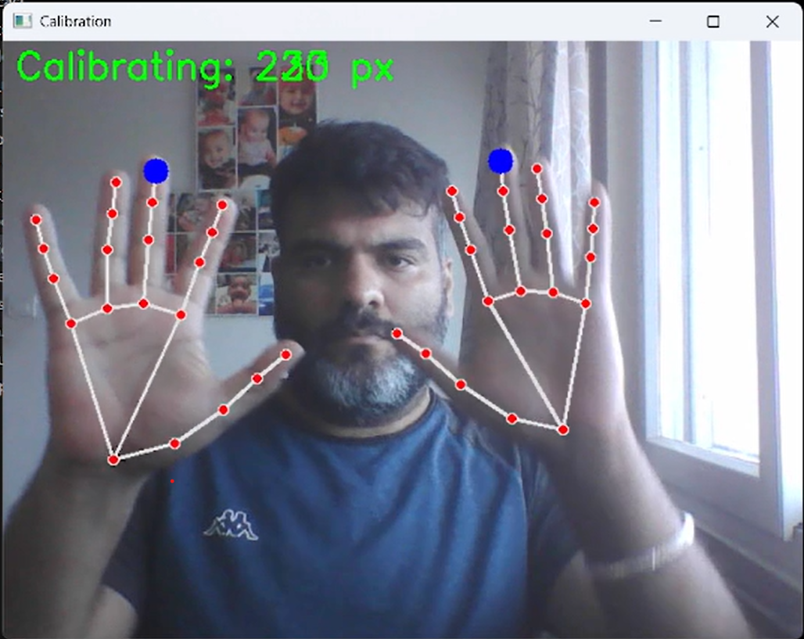
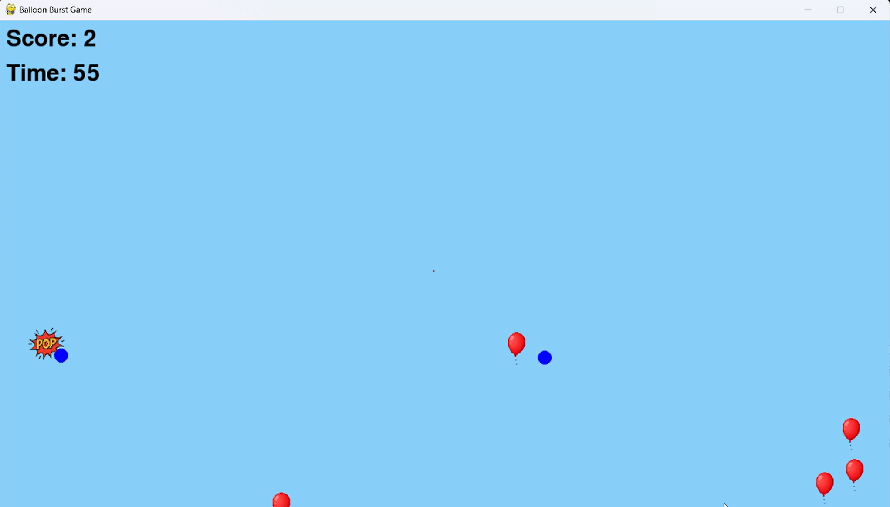

# 🎈 AI-Powered Balloon Burst Game

An interactive computer vision game where you burst floating balloons using real-time hand tracking via your laptop camera. Designed as a fun educational project for AI + game development practice.

---

## 🚀 **Features**

✅ Real-time **palm detection** with Mediapipe  
✅ **Floating balloons** with burst animation and sound  
✅ **Dual hand detection** (left and right)  
✅ **Difficulty levels:** Easy, Medium, Hard  
✅ **High score saving** across sessions  
✅ **Main menu screen** with interactive selection  
✅ Background music and pop sound effects

---

## 🛠 **Tech Stack**

- **Python 3.8+**
- **OpenCV**
- **Mediapipe**
- **Pygame**

---

## 📁 **Project Structure**

balloon_game/
├── main.py
├── config.py
├── game.py
├── menu.py
├── utils.py
├── assets/
│ ├── balloon.png
│ ├── burst.png
│ ├── pop.wav
│ └── bg_music.mp3
└── highscore.txt


---

## ⚙️ **Setup Instructions**

1. **Clone the repository:**

```bash
git clone https://github.com/yourusername/balloon-game.git
cd balloon-game

2.Create and activate virtual environment:

python -m venv venv
source venv/bin/activate   # Linux/Mac
venv\Scripts\activate      # Windows

3. Install Dependencies:

pip install -r requirements.txt

4. Run the game:
python ./main.py


✨ Future Enhancements
Build as a standalone EXE with PyInstaller

Integrate with Electron for desktop app UI

Add frame-by-frame burst animation

Add depth to it (make it 3D)

📷 Demo Screenshots



🤝 Contributions
Pull requests and feature suggestions are welcome to improve this educational AI game project.

📝 License
MIT License © 2025
